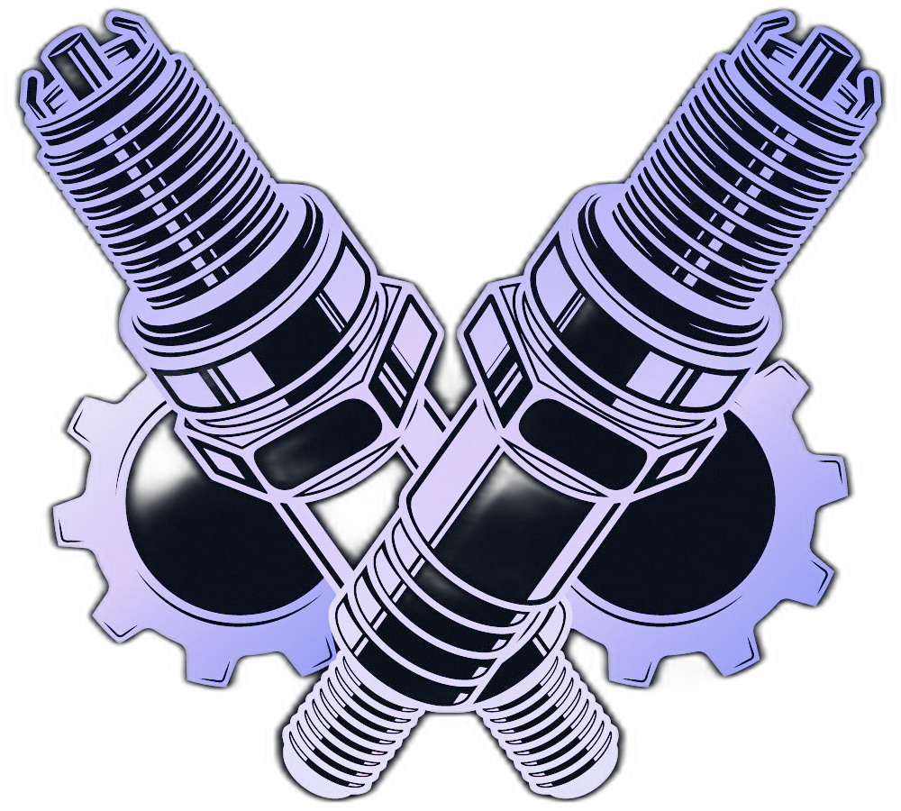

<h1>
  
  MechanicShop Management System
  
</h1>

A comprehensive, full-stack web application designed to streamline the daily operations of a modern mechanic shop. This system provides tools for managing work orders, customers, billing, and scheduling, all through a clean and intuitive user interface.

## 🏛️ Architectural Overview

This project is built using **Clean Architecture** principles to create a decoupled, maintainable, and testable system. It also incorporates concepts from **Domain-Driven Design (DDD)** and **Command Query Responsibility Segregation (CQRS)**.

The solution is divided into several distinct projects:

*   **`MechanicShop.Domain`**: The heart of the application. Contains core business models (Entities), Value Objects, and Domain Events. It has zero dependencies on other layers.
*   **`MechanicShop.Application`**: Orchestrates business logic using the MediatR library for CQRS. Defines features (use cases) through Commands and Queries.
*   **`MechanicShop.Infrastructure`**: Implements technical details like database access (EF Core + PostgreSQL), authentication (Identity), caching (HybridCache), and third-party integrations (Twilio, MailKit).
*   **`MechanicShop.Api`**: The presentation layer. An ASP.NET Core Web API exposing functionality via versioned RESTful endpoints.
*   **`MechanicShop.Client`**: A modern Single-Page Application (SPA) built with Angular 21.
*   **`MechanicShop.Contracts`**: Shared library containing DTOs for API/Client communication.

## ✨ Key Features

*   **Work Order Management**: Full lifecycle tracking from creation to completion, with real-time updates via SignalR.
*   **Customer & Vehicle Registry**: Detailed database for managing customer information and vehicle history.
*   **Intelligent Scheduling**: Calendar-based appointment management and technician assignment.
*   **Automated Billing**: Generate professional PDF invoices using QuestPDF based on labor and parts.
*   **Dashboard & Analytics**: Real-time overview of shop performance and key metrics.
*   **Identity & Security**: Secure authentication with JWT, role-based access control (RBAC), and rate limiting.
*   **Background Processing**: Automated tasks for monitoring overdue work orders and sending notifications.

## 💻 Technology Stack

### Backend
- **Framework**: .NET 10 (ASP.NET Core)
- **Database**: PostgreSQL with Entity Framework Core
- **Caching**: HybridCache (.NET 9+) & Redis
- **Messaging**: MediatR (In-process)
- **Real-Time**: SignalR
- **Validation**: FluentValidation
- **Logging**: Serilog with Seq sink

### Frontend
- **Framework**: Angular 21
- **Language**: TypeScript
- **State Management**: Reactive patterns with RxJS

### Observability & DevOps
- **Monitoring**: OpenTelemetry (Metrics & Traces)
- **Metrics**: Prometheus & Grafana
- **Log Management**: Seq
- **Containerization**: Docker & Docker Compose

## 🚀 Getting Started

### Prerequisites
- [.NET 10 SDK](https://dotnet.microsoft.com/download/dotnet/10.0)
- [Node.js & npm](https://nodejs.org/)
- [Docker Desktop](https://www.docker.com/products/docker-desktop)

### Option 1: Quick Start with Docker
The easiest way to get the entire stack (API, DB, Monitoring) running is using Docker Compose:

```bash
docker-compose up -d
```

Access the services:
- **API**: [http://localhost:5196](http://localhost:5196)
- **Swagger/OpenAPI**: [http://localhost:5196/openapi/v1.json](http://localhost:5196/openapi/v1.json)
- **Seq (Logs)**: [http://localhost:8081](http://localhost:8081)
- **Prometheus**: [http://localhost:9090](http://localhost:9090)
- **Grafana**: [http://localhost:3000](http://localhost:3000) (Admin: `admin` / `admin`)

### Option 2: Local Development

1.  **Backend**:
    ```bash
    cd src/MechanicShop.Api
    dotnet run
    ```
    *Note: Ensure you have a PostgreSQL instance running and update `appsettings.Development.json`.*

2.  **Frontend**:
    ```bash
    cd src/MechanicShop.Client
    npm install
    npm start
    ```
    Access the app at [http://localhost:4200](http://localhost:4200).

## 📊 Observability

This project implements the **Three Pillars of Observability**:
1.  **Logs**: Structured logging via Serilog, centralized in Seq.
2.  **Metrics**: System and business metrics collected by Prometheus and visualized in Grafana.
3.  **Traces**: Distributed tracing via OpenTelemetry to visualize request flows and identify bottlenecks.

## 📄 License
This project is licensed under the MIT License - see the LICENSE file for details.
